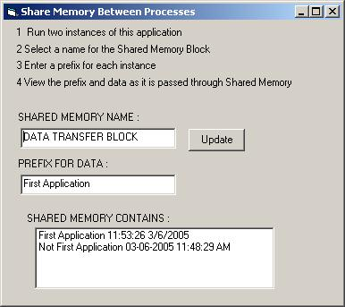



## CSharedMemory

### Description

Share memory between processes. Write a port daemon to continually read data and make it available via shared memory to any number of running applications. Easy To Use: Dim S as new CSharedMemory : S.sharedMemory "BlockName",1000 : S.memory="Shared Data" : Print S.memory
 
### More Info
 
Requires a string containing the user defined name for the shared memory block and the block size in bytes.

A string placed in the shared memory block can be retrieved by any application which knows the name of the shared memory block.

Shared memory blocks are created but never destroyed until the system is rebooted. Don't make more blocks than are required.

             |
---                |---
**Submitted On**   |2005-03-06 22:05:04
**By**             |[surfaceLife](https://github.com/Planet-Source-Code/PSCIndex/blob/master/ByAuthor/surfacelife.md)
**Level**          |Advanced
**User Rating**    |4.7 (28 globes from 6 users)
**Compatibility**  |VB 6\.0
**Category**       |[Custom Controls/ Forms/  Menus](https://github.com/Planet-Source-Code/PSCIndex/blob/master/ByCategory/custom-controls-forms-menus__1-4.md)
**World**          |[Visual Basic](https://github.com/Planet-Source-Code/PSCIndex/blob/master/ByWorld/visual-basic.md)
**Archive File**   |[CSharedMem186174362005\.zip](https://github.com/Planet-Source-Code/surfacelife-csharedmemory__1-59339/archive/master.zip)

